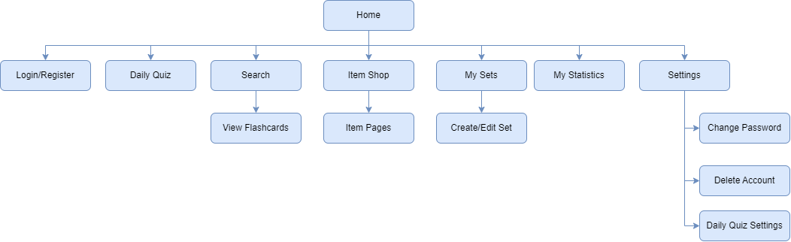

# QuizVerse

> An easy to use spaced repetition study assistant modeled after existing related software!

## What is QuizVerse Exactly?

Trying to learn something new can be hard. Studying consistently can be even harder. Meet **QuizVerse**: your new study tool and accountability buddy, all in one app.

Spaced repetition is a proven strategy with flashcards to help memory retention in learning. In this system, a learner categorizes their flashcards by their difficulty, and they repeatedly study the flashcards they struggle with the most repeatedly over several study sessions. Not only does this increase a learner's exposure to hard topics, spaced out study sessions have also been shown to be more effective and efficient than cramming.

All of these strategies are great, but they can be hard to implement on your own with clunky boxes of flashcards. Let QuizVerse do the heavy lifting for you.

Whenever you have something new to learn, just upload or type out your flashcards on QuizVerse and choose how many flashcards you want to review everyday. The app will remind you to study daily and give you points for a successful study session. Want to study beyond your scheduled daily sessions? QuizVerse also lets you freely study whenever you choose.

Who said studying couldn't be fun *and* fast?

## For whom?

QuizVerse is designed with both students (like us) and teachers in mind, to help create a platform for learning through spaced repetition. For students approaching a new subject and preparing for an upcoming exam, to teachers who want to create an aggregated flashcard set to provide to their class, QuizVerse is created with all those use cases in mind. QuizVerse will work to maximize retention and activity for students through gamification, drawing from experience working with different platforms that offer services to self-study.

## How?

First, create a username and password to create an account to save your flashcards under.

To add new flashcards, just enter them as text or as images. You can also categorize the flashcards by the due date and subject.

In your daily study session, QuizVerse will provide you with one side of the flashcard, and you'll have to recall what's on the other side. By completing your daily study session, you will receive points and extend your study streak. Your study streak will be displayed whenever you enter the app.

You can also study on demand whenever you want to get points. You can narrow down what you want to study by subject or other category.

Want to see how you're doing and what you need to spend more time on? QuizVerse can you show your study statistics and tell you which concepts you are doing better with.

With QuizVerse, you can also share a set of flashcards with your friends and classmates. If you're a teacher or professor, you can create a flashcard set to share with your students. Your shared flashcards can also be password protected for privacy.

---
## Product Vision Statement:
At a bare minimum, QuizVerse will allow users to create their own flashcards, and use the app to study those flashcards through the process of spaced repetition.
We will also implement a Daily Quiz feature that will quiz a user everyday, and create a rewards system to incentivize studying.

## History of the Project:

Here at QuizVerse, we are tired of the current flashcard app market. Too many are clunky and confusing, like Anki, or require a steep paywall, like Quizlet. We strive to create a more accessible, more simple, and more fun tool for studying available to any student out there.

## Our core development team:
* Matthew Dong [GitHub](https://github.com/Matt-J-Dong)
* James Chen [GitHub](https://github.com/1019jchen)
* Jonathan Zhou [GitHub](https://github.com/chiyanz)
* Rohan Khanderia [GitHub](https://github.com/RohanK6)
* Mert Bayturk [GitHub](https://github.com/mertbayt)

## Roles:
* Sprint 0 Product Owner: Mert
* Sprint 0 Scrum Master: James

* Sprint 1 Product Owner: James
* Sprint 1 Scrum Master: Jonathan

* Sprint 2 Product Owner: Jonathan
* Sprint 2 Scrum Master: Matthew

* Sprint 3 Product Owner: Matthew
* Sprint 3 Scrum Master: Rohan

* Sprint 4 Product Owner: Rohan
* Sprint 4 Scrum Master: Mert

## Contributing to QuizVerse:
If you want to contribute to QuizVerse, here are the related guidelines: [Link](./CONTRIBUTING.md)

## Build/Test QuizVerse:
Information on how to build and test QuizVerse yourself, if you choose to do so:
1. Obtaining the code for this repository:
    * Clone the code for the repository onto your local machine.
    * Navigate into the project directory `./final-project-quizverse`
2. Build and run the front end code
    * Navigate into the front end directory `cd front-end`
    * Run `npm install` to install all necessary dependencies
    * Run `npm start` to start running the code
    * The front end will be running at http://localhost:3000, assuming port 3000 was not previously in use.
3. Build and run the back end code:
    * Create a new terminal so the front end and back end can run simultaneously
    * Navigate into the back end directory `cd ../back-end` (or `cd back-end` if you have already navigated back to the root directory)
    * Run `npm install` to install all necessary dependencies
    * Run `npx nodemon server.js` to start running the code
    * The back end will be running at http://localhost:3001, assuming port 3001 was not previously in use.

**The application should now be fully functional! Navigate to http://localhost:3000 and enjoy using QuizVerse!**

4. If you wish to test the code:
    * Create a new terminal for your testing results
    * Navigate into the back end directory (`./final-project-quizverse/back-end` should be your current directory)
    * Make sure the back end is ***not*** running, the test script generates its own version of the backend, having both running will create a conflict for the port.
    * Run `npm test`
    * Press **Ctrl+C** to close out the current testing run

## App Map:

*Link to hosted version here? QuizVerse.com*

<!--Idk this is some comment-->